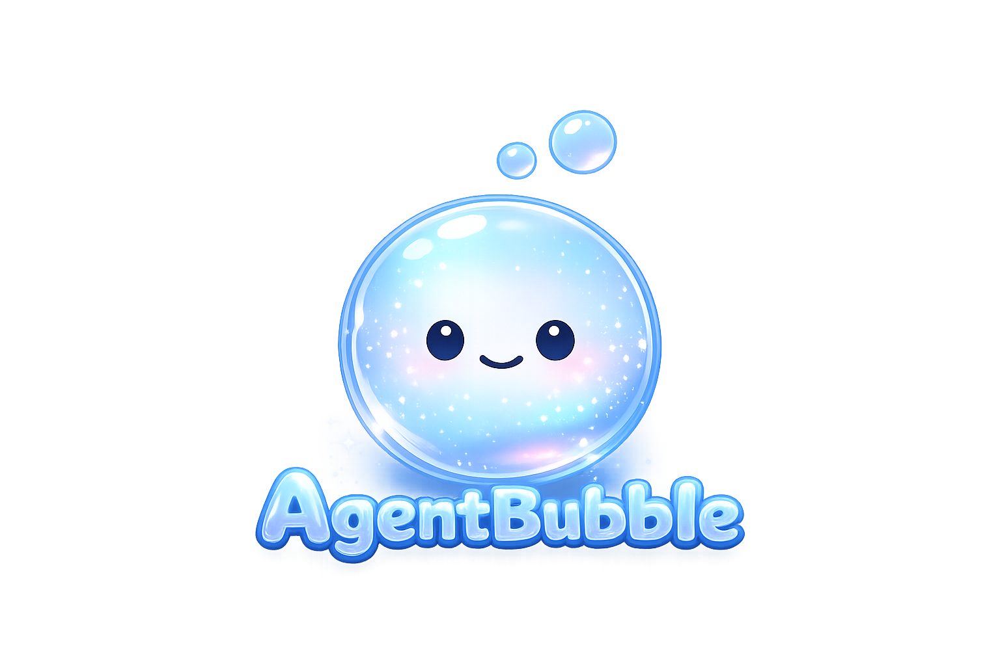

# AgentBubble

Run your agents with confidence.

[](https://www.npmjs.com/package/agentbubble)
[](LICENSE)

<p align="center">
  
</p>

AgentBubble is a practical operating system for human-directed agentic engineering.

It defines how experienced engineers safely work with coding agents in production environments: provide bounded context, clarify the ticket, implement minimally, test, audit, and prepare work for QA.

**The agent may implement, but it may not silently redefine the problem.**

## Core Philosophy

Agents are powerful but stochastic. They can write useful code quickly, but they need clear boundaries, current context, and explicit acceptance criteria.

AgentBubble treats agent work as engineering work:

- preserve the existing architecture
- follow established patterns
- mutate the smallest necessary surface area
- avoid opportunistic refactors
- verify behavior before claiming completion
- audit the diff against the original ticket

The goal is not autonomy. The goal is reliable execution under human direction.

## Execution Loop

Context → Ticket Understanding → Plan → Minimal Implementation → Test → Audit → Fix → QA-Ready

The loop prevents agents from wandering through the codebase, expanding scope, or optimizing for plausible output instead of correct work.

## Installation

AgentBubble is installed into a project by creating a local `.agentbubble/` folder from the base template. After installation, agents should use the local `.agentbubble/` files as their operating context instead of rereading the public repo every session.

CLI:

`npx agentbubble init`

The CLI is deterministic and local-only: it copies `templates/base/.agentbubble/`, scans file signals, fills known fields, and leaves unknowns marked.

See [install.md](install.md) for the recommended install flow.

## CLI Workflow

1. Install the local operating layer:

`npx agentbubble init`

2. Add your ticket to `.agentbubble/current-ticket.md` and tell your agent: "Ticket is ready. Begin intake."

3. Work the coding session with your agent.

4. Audit changed files before review:

`npx agentbubble audit`

Example audit output:

```text
Ticket Scope Audit

Declared scope:
- frontend/app/(app)/calendar/

Changed files:
1

Clean Changes: 1

No scope drift detected.
```

## Context Bubble

A context bubble is the bounded working environment an agent uses to reason about a task.

It should include:

- product goal
- current architecture
- coding patterns
- brand/taste rules
- security rules
- database rules
- do-not-touch areas
- known failure modes
- definition of good work

Agents are only as good as the context bubble they operate inside.

## Vibe Coding vs Agentic Engineering

Vibe coding asks an agent to produce something that feels right.

Agentic engineering asks an agent to solve a defined problem inside explicit constraints, then prove the change is safe enough for review.

The difference is not tool choice. The difference is discipline:

- scoped tickets
- architectural respect
- minimal mutation
- testable acceptance criteria
- diff inspection
- QA readiness

If AgentBubble saved you from a bad merge,
drop a ⭐ — it helps others find it.

## Repository Contents

- `philosophy.md`: core operating model
- `context-factory.md`: project context compression
- `ticket-intake-loop.md`: pre-implementation scope control
- `implementation-loop.md`: safe coding rules
- `audit-loop.md`: review and risk inspection
- `definition-of-done.md`: QA and production readiness
- `install.md`: installation guide
- `prompts/`: copy-paste prompts
- `templates/`: reusable specs, checklists, and base `.agentbubble/` files
- `skills/`: tool-specific adapter guidance
